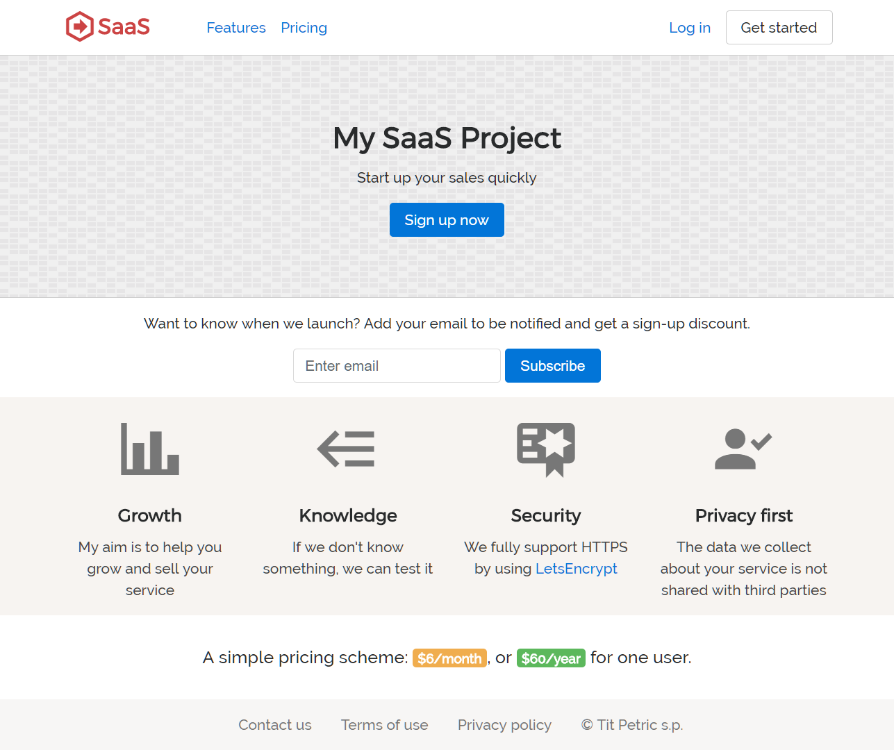
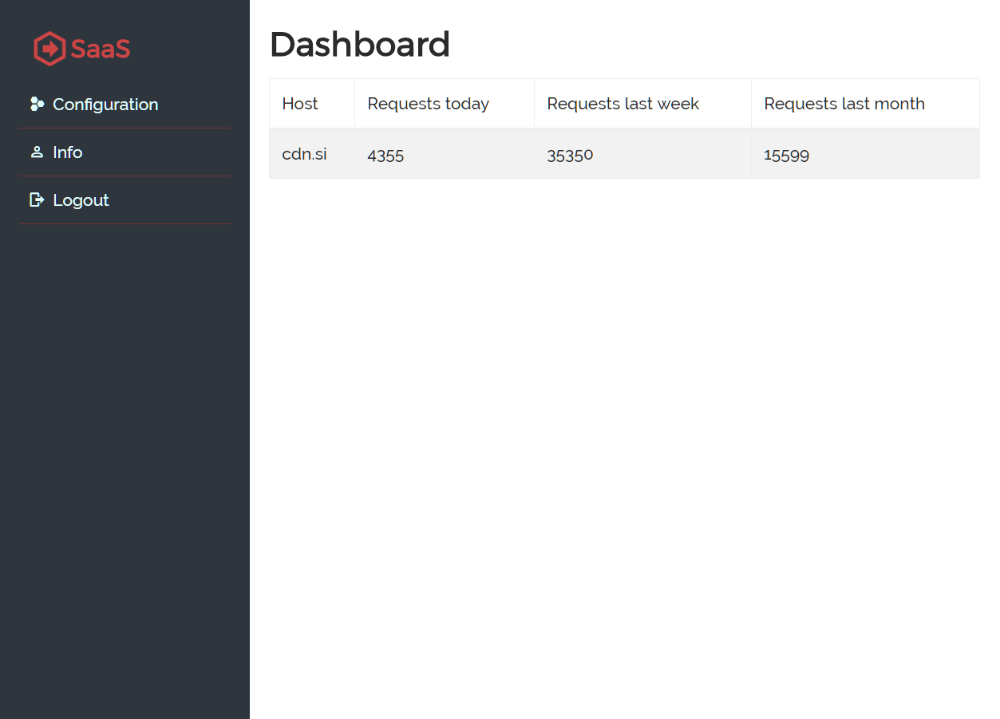

# SaaS Front

This is the front-end application to quickstart your SaaS development. Various parts of it
have been discussed in [The SaaS Handbook](https://leanpub.com/saas-handbook).

> If you want to contribute (especially in the CSS/design area), please follow me on
> Twitter [@TitPetric](https://twitter.com/TitPetric) and let's talk. Pull requests welcome.

## Commands

This is a SaaS project template. It's built with Vue.js using the provided scripts:

- `create.sh` - was used to build a vanilla `src/` folder with a Vue.js app,
- `build.sh` - used to build your Vue.js app into `src/dist/`,
- `deploy.sh` - invokes a firebase deployment.

Building the project will create a `dist/` folder under the `src/` project root.
This folder is used for publishing to Firebase or some other static web site host.
You'll need to modify the provided `.firebaserc` for a different deployment.

You can view the template in action here:

Hosting URL: https://my-saas-project-6de9d.firebaseapp.com

It uses Firebase as it's authentication method, so you can sign up, login, logout and
inspect the look and feel of this template. The template provides a reasonable front-end
design and something basic for the back-end.

## Design

This is what I could come up with my two left hands.

### Front page

### Backend dashboard

## Intended use

This project is meant to sit at the document root. This means that any files that are under
the `src/dist/` folder should be placed in a public html location to be served from the root
of the domain, like `example.com`, and not `example.com/app`.

When using Google Firebase or other static hosts, this might mean that you'll have to set
up a separate domain for dynamic requests or APIs. This means that you would load your resources
from `api.example.com` instead of `example.com/api`. Keep this in mind.

## Misc

The build procedure also creates .gz files for static content. This can be used by nginx
to serve compressed assets directly to users instead of reading the uncompressed version
and then compressing it every time a user requests data. This feature is available as
an add-on module in nginx, [gzip_static](http://nginx.org/en/docs/http/ngx_http_gzip_static_module.html).
Most distributions (Debian, Ubuntu) provide a version of nginx with this module compiled in.
